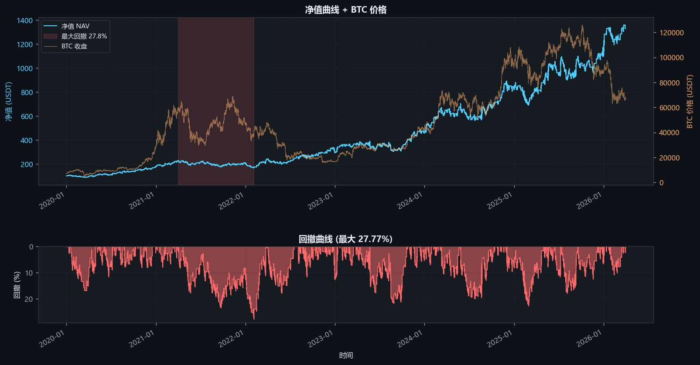
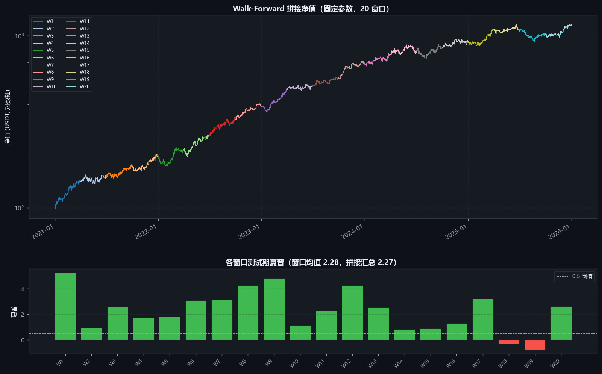
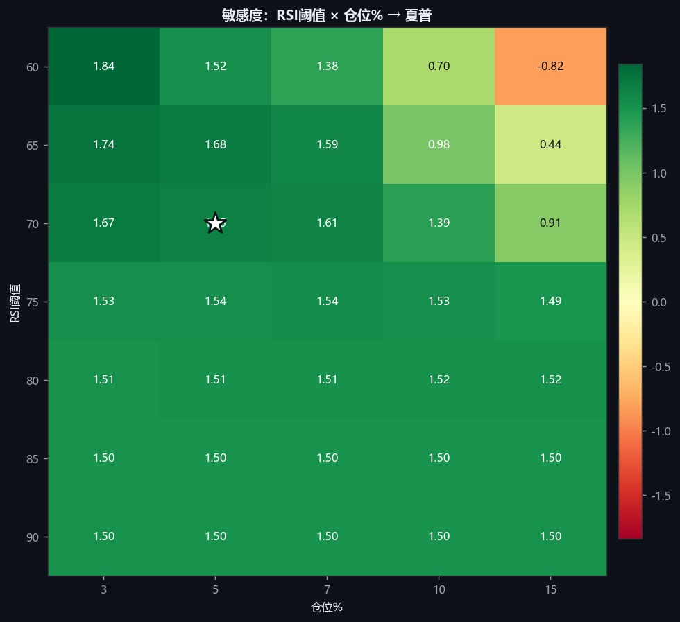
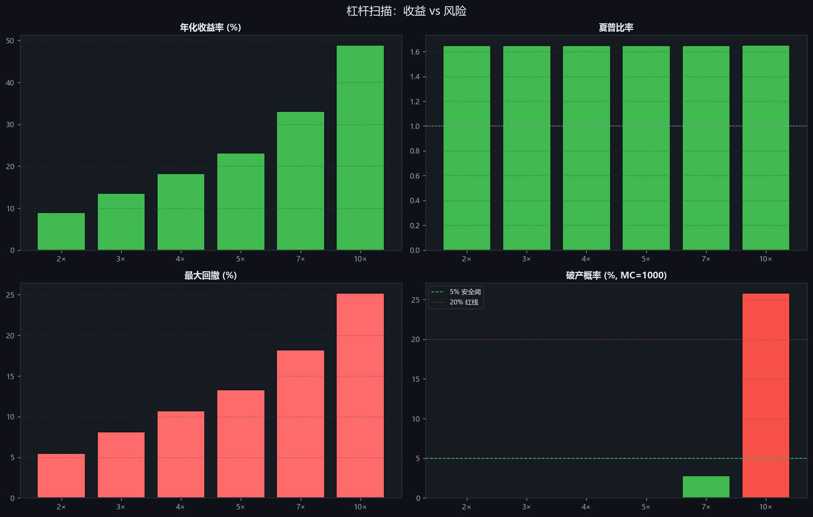
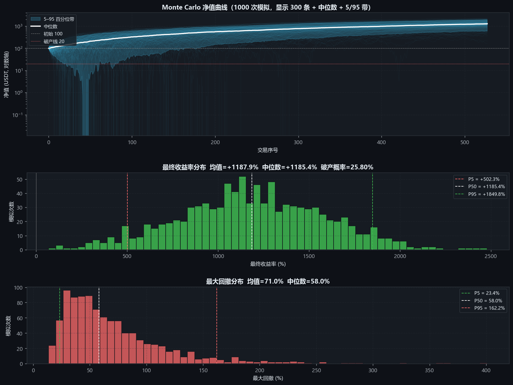

# quant-btc

A **symbol-driven (rule-based) BTC/USDT futures quantitative trading system** built end-to-end in Python — from raw data ingestion to backtesting, parameter search, walk-forward validation, Monte-Carlo risk simulation, and an interactive Streamlit dashboard.

Strategies are expressed as YAML rules (no black-box ML). Every signal can be traced back to a human-readable condition; every parameter is in a config file.

---

## Features

- **Data pipeline** — historical OHLCV + funding rate + open interest + Fear & Greed Index + long/short ratio + top-trader ratio, all pulled from `data.binance.vision` (CDN, works in restricted networks) and stored as Parquet monthly partitions.
- **Indicator engine** — 18 indicators (SMA / EMA / MACD / ADX / RSI / Stoch / CCI / Williams%R / MFI / Bollinger / ATR / Keltner / OBV / VWAP / CMF / `taker_buy_ratio` / `oi_change` / `fear_greed_ma` / `rolling_max` / `rolling_min`) wrapped over `pandas-ta`, all input/output in Polars.
- **Symbolic rule engine** — YAML-based strategy DSL: threshold comparisons (`>`, `<`, `>=`, …), cross detection (`above` / `below`), state memory (`from_above` / `to_below`), AND/OR + nested condition groups, multi-timeframe alignment, signal-conflict arbitration.
- **Backtest engine** — leveraged perpetual futures with same-side averaging, opposite-side reversal, stop-loss / take-profit / liquidation, max-drawdown circuit breaker, daily-loss limit, funding-rate settlement at 0/8/16 UTC, slippage + double-sided fees.
- **Visualization** — dark-theme matplotlib reports: equity curve + drawdown, trade markers on price chart, monthly-return heatmap, PnL distribution, holding-time distribution.
- **Optimization & validation** — grid-search optimizer with overfit detection, walk-forward rolling validator (in-window optimization optional), parameter sensitivity heatmaps.
- **Risk analysis** — Monte-Carlo bootstrap of trade PnLs (1000+ resampled paths), ruin probability, return + drawdown 95% confidence intervals, leverage-vs-ruin scan.
- **Interactive dashboard** — Streamlit app with 4 pages: live backtest with parameter sliders, multi-strategy comparison, K-line + indicators browser, MC + leverage risk view.
- **Tested** — 37 unit tests covering indicators, rule engine, backtester (open/close/PnL/SL/TP/liquidation/funding/fees).

---

## Screenshots

### 1. Equity curve + drawdown (best strategy)


### 2. Walk-forward validation (20 rolling windows, fixed best-v2 params)
Cumulative test-period equity colored per window, plus per-window Sharpe bars.


### 3. Parameter sensitivity heatmap (RSI threshold × position size)
Star marks current best; cells show out-of-sample Sharpe ratios.


### 4. Leverage → ruin probability scan
At 10× the ruin probability is 25.8% — too risky. 7× brings it to 2.8% (acceptable).


### 5. Monte-Carlo bootstrap (1000 resampled equity paths)
Final-return distribution and max-drawdown distribution, with percentile lines.


---

## Quick Start

### 1. Install (uv-managed; Python 3.12+)

```bash
git clone https://github.com/Hooper18/quant-btc.git
cd quant-btc
uv sync
```

### 2. Download data (~5–10 min, ~3 GB Parquet)

```bash
# smoke test (1 month of 1d bars)
uv run python scripts/download_all.py --test

# full pipeline (all timeframes 2020-01 → last complete month)
uv run python scripts/download_all.py

# verify integrity
uv run python scripts/inspect_data.py
```

### 3. Run a backtest

```bash
# default v2-optimized strategy
uv run python scripts/run_backtest.py --strategy config/strategies_v2_optimized.yaml

# skip plots if you only need numbers
uv run python scripts/run_backtest.py --strategy config/strategies.yaml --no-plot
```

Each run writes `output/backtest_<timestamp>/` containing `report.html`, equity-curve PNG, monthly-return heatmap, trade-marker chart, full `trades.csv`.

### 4. Open the dashboard

```bash
uv run streamlit run app/dashboard.py
```

Visit http://localhost:8501 — 4 pages: backtest with sliders, strategy comparison, K-line browser, risk analysis.

### 5. Other useful scripts

```bash
# multi-strategy comparison + overlay chart
uv run python scripts/compare_strategies.py config/strategies.yaml config/strategies_v2_optimized.yaml ...

# parameter grid search (with train/test split + overfit check)
uv run python scripts/optimize.py --strategy config/strategies.yaml

# walk-forward validation
uv run python scripts/walk_forward.py --strategy config/strategies_v2_optimized.yaml
uv run python scripts/walk_forward.py --strategy config/strategies.yaml --optimize  # in-window grid search

# 2D sensitivity heatmaps
uv run python scripts/sensitivity_heatmap.py

# Monte-Carlo bootstrap
uv run python scripts/monte_carlo.py --strategy config/strategies_v2_optimized.yaml

# leverage → ruin probability scan
uv run python scripts/leverage_scan.py

# trade-record deep analysis (by hour / weekday / month / holding / FGI regime)
uv run python scripts/trade_analysis.py --strategy config/strategies_v2_optimized.yaml

# unit tests
uv run pytest tests/ -v
```

---

## Architecture

```
quant-btc/
├── src/
│   ├── data/          # Vision CDN downloaders + Parquet I/O + data merger
│   ├── indicators/    # IndicatorEngine (pandas-ta wrapped, Polars in/out)
│   ├── engine/        # RuleEngine (YAML strategy → Signal)
│   ├── backtest/      # Backtester + Visualizer + Optimizer + WalkForward + MonteCarlo
│   └── utils/         # DataConfig & helpers
├── scripts/           # CLI entry points (download / backtest / compare / optimize / WF / MC / sensitivity / trade-analysis / leverage-scan)
├── app/
│   └── dashboard.py   # Streamlit interactive UI
├── config/            # YAML configs (data + strategies + backtest)
├── tests/             # pytest unit tests
└── data/parquet/      # OHLCV + funding + OI + FGI + LS/TT (gitignored)
```

**Data flow per backtest**:

```
config/data_config.yaml ──► data/parquet/...
                                 │
config/strategies*.yaml          ▼
        │              load_aux_data + build_data_dict (merge_market_data
        │                + IndicatorEngine.compute_all)
        │                                 │
        ▼                                 ▼
   RuleEngine ◄──────────── data_dict[tf] (with merged columns + indicators)
        │
        ▼
   evaluate(bar_idx) → Signal[]
        │
        ▼
   Backtester (PositionManager + SL/TP/liquidation/funding) → BacktestResult
        │
        ├─► BacktestVisualizer → PNG + HTML
        ├─► MonteCarloSimulator → ruin probability + return/DD CIs
        └─► trade_analysis.py → 6 deep-dive slices
```

### Key configuration files

| File | Purpose |
|---|---|
| `config/data_config.yaml` | symbol, timeframes, history start, retry policy |
| `config/backtest_config.yaml` | initial balance, leverage, fees, slippage, drawdown circuit breaker, funding epochs |
| `config/strategies*.yaml` | one or more strategies with conditions / logic / action / SL / TP |

To add a new strategy: write a YAML file. No code change needed.

---

## Performance highlights

The v2-optimized strategy (RSI=55 short + MACD-cross long) over **2020-01 → 2026-03 1h-bars** with Phase-9 + Phase-10 validation:

| Metric | Single-period backtest | Walk-forward (20 windows) |
|---|---:|---:|
| Total return | +1102% | +1057% |
| Annualized | +49% | +63% |
| Sharpe | 1.65 | **2.27** |
| Max drawdown | 25% | 21% |
| Win rate | 46% | 58% |
| Trades | 527 | 810 |

**Recommended production config**: `strategies_v2_optimized.yaml` + leverage = **7×** (Monte-Carlo ruin probability < 5%; 10× brings ruin to 26%).

---

## Known limitations

- **`fapi.binance.com` is blocked at DNS level in mainland China** → REST endpoints unavailable. Funding-rate downloader falls back to vision CDN; OHLCV current-month increments cannot be fetched (must wait for next month's vision archive).
- **Open interest data starts 2020-09** (vision daily-metrics archive begins there).
- **Walk-forward in-window optimization tends to overfit** — see Phase 10 report; fixed parameters (single-period grid search) generalize better than per-window re-optimization.
- **Monte-Carlo assumes IID trade PnLs** — ignores time-series dependencies; provides a *lower bound* on tail risk.
- This system is built around a **single asset** (BTCUSDT perp). Multi-asset portfolio support is not implemented.

---

## Disclaimer

⚠️ **This software is for educational and research purposes only.**

- Backtests reflect *historical* behavior; past performance is not a reliable indicator of future results.
- Cryptocurrency derivatives (especially leveraged perpetual futures) involve **significant risk of total loss**, including losses exceeding the initial deposit.
- Demonstrated metrics (e.g. +1057% return) come from a specific 6-year sample; survivorship bias, slippage assumptions, and exchange-side issues (rate limits, outages, liquidation cascades) may materially alter live performance.
- Even the conservative 7× leverage configuration carries a **2.8% ruin probability** under bootstrap simulation.
- The author and contributors accept **no liability** for any financial loss arising from use of this software.

If you are not a quantitative researcher or experienced derivatives trader, **do not deploy this code with real funds**. Test in paper trading, understand every line, and consult licensed financial advice for actual investment decisions.
